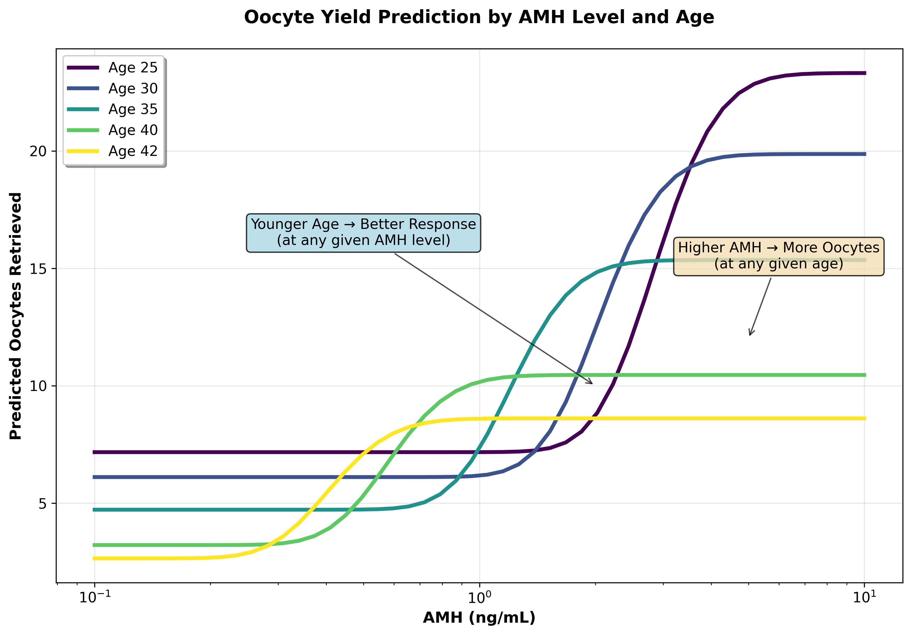
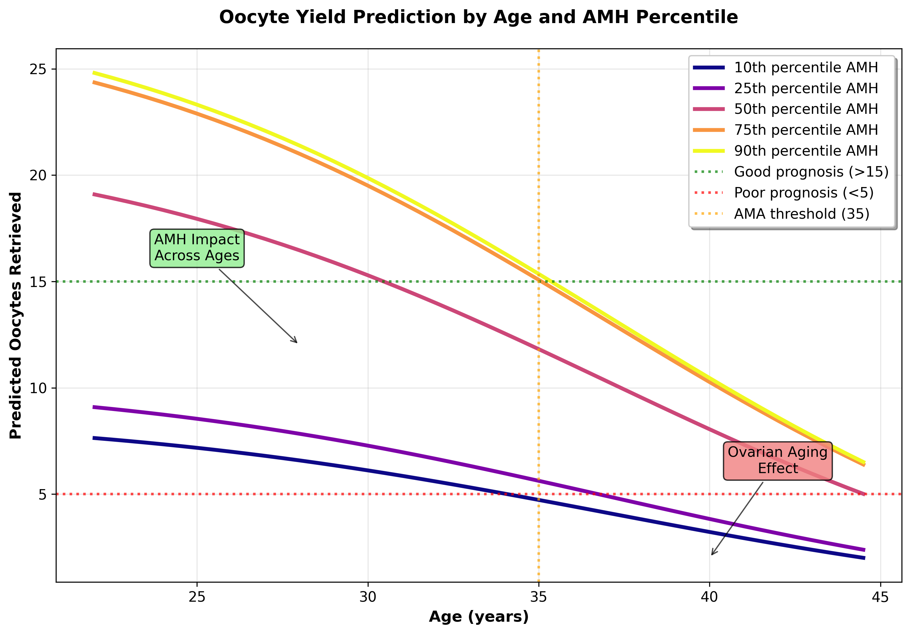
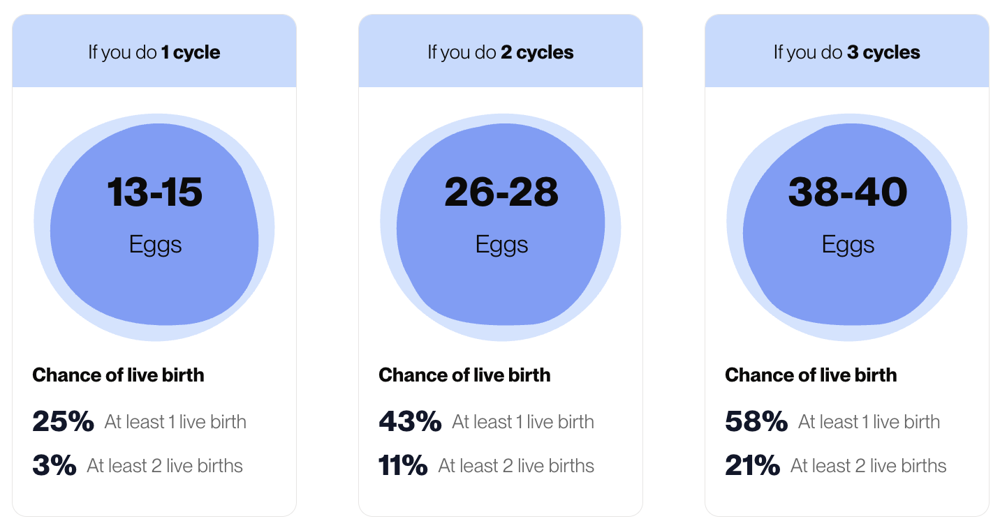
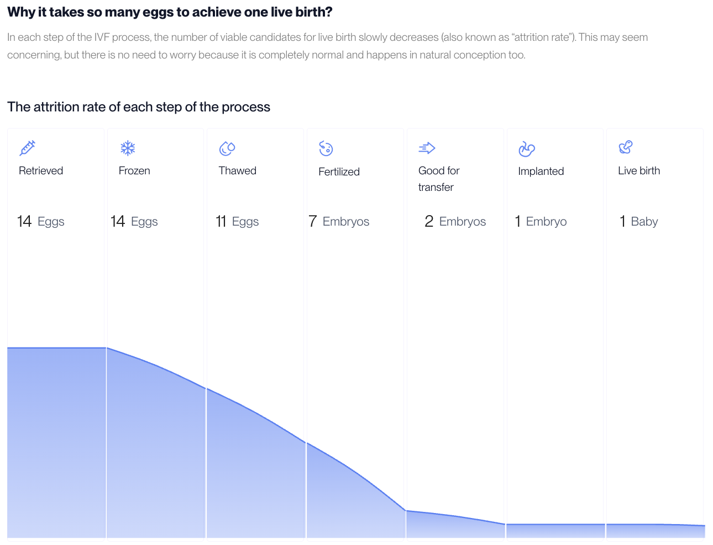
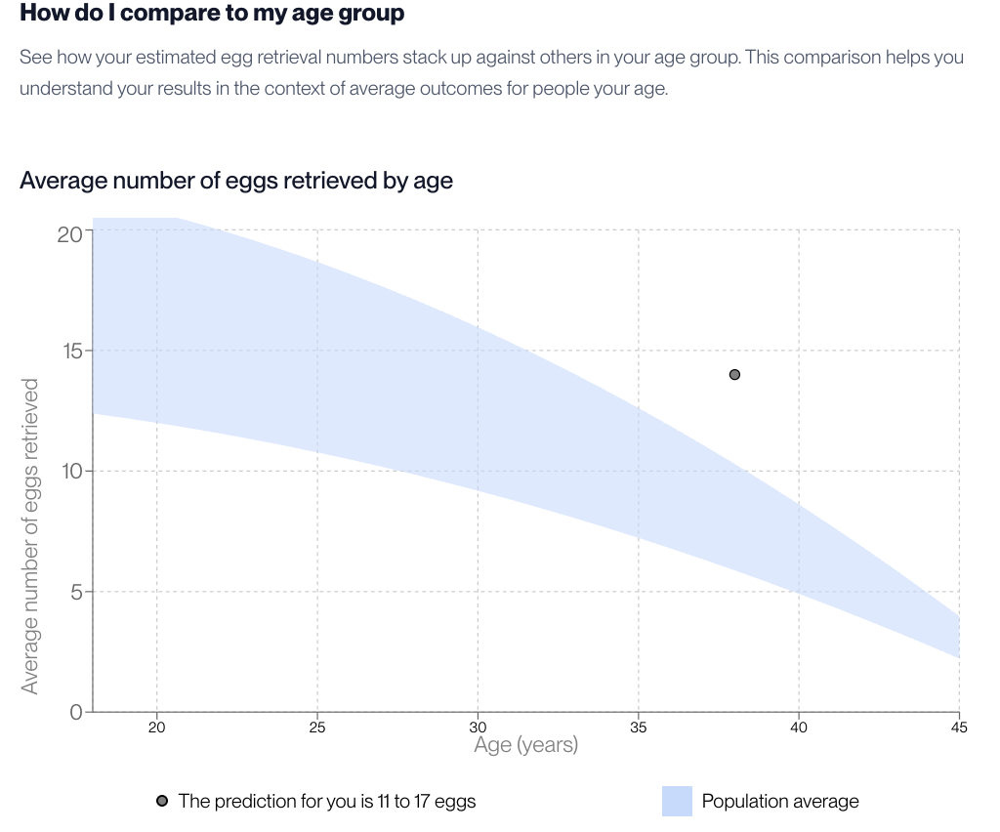
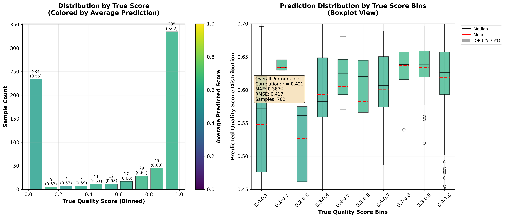
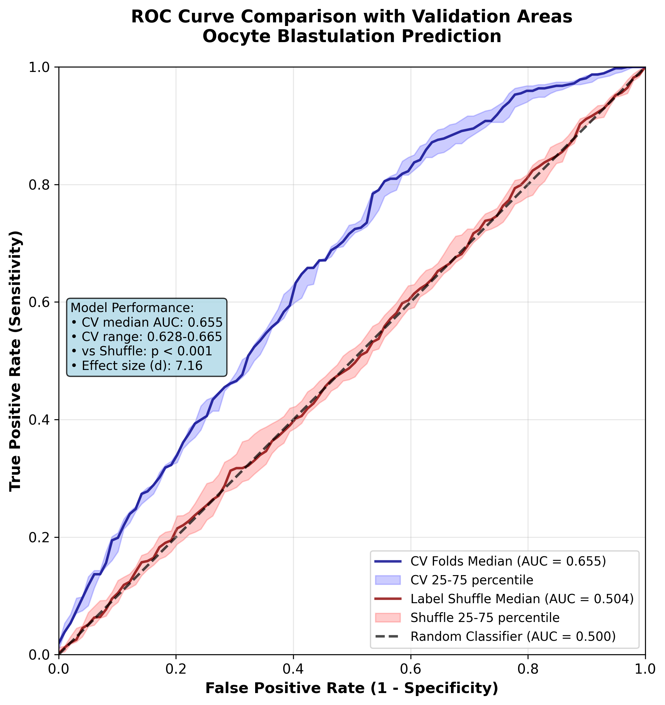
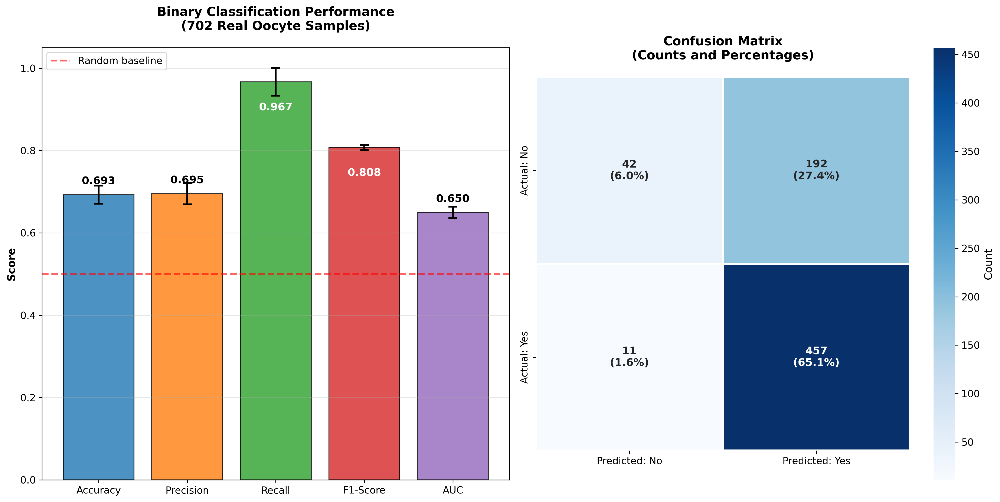

# Data-Driven IVF Counseling: Integrating Oocyte Quality Assessment with Personalized Cycle Predictions

[](paper_latex_sn/main.pdf)
[](https://zenodo.org/records/6390798)
[](LICENSE)

**Authors:** David Silver¹*, Gilad Rave¹, Taher Odeh¹, Riska Fadilla¹  
**Institution:** ¹Rhea Labs, Rhea Fertility, Singapore  
**Paper:** 24 pages, 8 figures, 42 references  
***Corresponding author:** david.silver@rhea-fertility.com

---

## 📄 Paper Summary

This research presents a **comprehensive dual-model framework** that revolutionizes IVF counseling by combining:

1. **🧮 Enhanced Parametric Calculator**: Complete IVF cycle simulation from oocyte retrieval through live birth with stage-specific attrition modeling
2. **🔬 AI Quality Assessment**: Vision Transformer model analyzing post-ICSI oocyte morphology for blastulation prediction

### Key Innovation
- **Complete IVF Cycle Simulation**: Multi-stage attrition modeling from retrieval to live birth
- **Age-dependent AMH interpretation**: Personalized percentiles vs misleading fixed ranges
- **Post-ICSI, pre-2PN analysis**: Earliest possible oocyte quality prediction
- **Real clinical data**: 702 embryo samples from standardized EmbryoScope™ time-lapse imaging
- **Clinical example integration**: Margaret Hughes case demonstrating multi-cycle projections

---

## 🎯 Key Results

| **Component** | **Parametric Calculator** | **Oocyte Quality Model** |
|---------------|---------------------------|---------------------------|
| **Purpose** | Complete IVF cycle simulation | Blastulation success prediction |
| **Input** | Age + AMH + AFC + patient factors | Post-ICSI oocyte images |
| **Output** | Multi-cycle projections, live birth probabilities | Quality scores + classification |
| **Performance** | Comprehensive attrition pipeline | r=0.421, 71.1% accuracy, 97.6% sensitivity |
| **Clinical Value** | Evidence-based multi-cycle counseling | Objective embryologist support |

### Biological Insight
Our analysis reveals the **asymmetric nature of oocyte prediction**: while high-quality oocytes can fail due to external factors (media conditions, lab environment), truly defective oocytes should not succeed. This biological reality means perfect prediction would have **zero false positives** but inevitable **false negatives**, explaining why our model's high sensitivity (97.6%) with modest specificity (23.1%) reflects appropriate biological constraints.

---

## 📊 Publication Figures

### Parametric Calculator Performance

*Figure 1: Age-dependent AMH interpretation showing personalized oocyte yield predictions*


*Figure 2: Age-stratified oocyte yield analysis with clinical thresholds*

### Clinical Example: Margaret Hughes (Age 38, AMH above median)

*Figure 3: Multi-cycle projection interface (13-15 → 26-28 → 38-40 eggs, 25% → 43% → 58% live birth probability)*


*Figure 4: Complete IVF attrition pipeline (14 retrieved eggs → 1 live birth)*


*Figure 5: Patient predictions vs age-group population averages*

### Oocyte Quality Assessment

*Figure 6: Quality score correlation with blastulation outcomes (r=0.421, p<0.001)*


*Figure 7: Model performance vs baselines with statistical validation (AUC=0.655)*


*Figure 8: Comprehensive performance metrics with cross-validation uncertainty*

---

## 📁 Repository Structure

```
📦 oocyte_results/
├── 📄 paper_latex_sn/                    # LaTeX paper & compilation
│   ├── main.tex                          # Main document with 4 authors
│   ├── main.pdf                          # 24-page compiled paper
│   ├── sections/                         # Enhanced paper sections
│   │   ├── introduction.tex              # Clinical motivation
│   │   ├── methods.tex                   # Comprehensive methodology
│   │   ├── results.tex                   # Results with biological insights
│   │   ├── discussion.tex                # Clinical implications
│   │   └── conclusion.tex                # Summary & future directions
│   ├── figures/                          # 8 publication-ready figures
│   │   ├── calculator_*.png              # Parametric calculator plots
│   │   ├── Oocyte*.png, Attrition.png, AgeGroup.png # Clinical example
│   │   └── oocyte_*.png                  # Quality assessment results
│   ├── references.bib                    # 42 validated references
│   └── sn-jnl.cls                        # Springer Nature journal class
├── 🧮 calculator/                        # Enhanced parametric calculator
│   └── parametric_cycle_calculator.py    # Complete IVF cycle simulation
├── 📊 binary_labels/                     # Binary classification pipeline
│   ├── blastulation_binary_labels.csv    # 702 binary outcomes
│   ├── train_binary_model.py            # ViT training pipeline
│   ├── binary_cross_validation_results.csv # 8-fold CV performance
│   └── vit_model_binary.pth             # Trained model weights
├── 📈 continuous_labels/                 # Continuous quality prediction
│   ├── blastulation_quality_scores.csv   # Quality scores (0-1 range)
│   ├── train_continuous_model.py        # Continuous training pipeline
│   └── continuous_cross_validation_results.csv # CV results
├── 🔬 data_analysis/                     # Comprehensive analysis suite
│   ├── analyze_binary_model.py           # Binary performance analysis
│   ├── analyze_continuous_model.py       # Continuous model analysis
│   ├── analyze_parametric_calculator.py  # Calculator validation
│   ├── run_all_analyses.py              # Complete pipeline
│   └── processed/                        # Analysis outputs & metrics
├── 📊 plotting/                          # Publication figure generation
│   ├── plot_calculator_focused.py        # Calculator visualizations
│   ├── plot_oocyte_quality_focused.py   # Quality assessment plots
│   ├── create_all_plots.py              # Generate all 8 figures
│   └── figures/                          # Generated outputs
├── 🎯 clinical_examples/                 # Real patient case studies
├── 📋 review_fix.md                      # Comprehensive review responses
├── 🐍 requirements.txt                   # Python dependencies
└── 📖 README.md                          # This comprehensive guide
```

---

## 🔬 Enhanced Methodology

### Comprehensive Parametric Calculator
- **Complete IVF Cycle Simulation**: Retrieval → Frozen → Thawed → Fertilized → Good Embryos → Implanted → Live Birth
- **Stage-specific attrition rates** with age-dependent adjustments
- **ORPI calculation** (AMH × AFC / age) when follicle count available
- **Multi-cycle projections** with cumulative success probabilities
- **Patient-specific factors**: BMI, ethnicity, health conditions at appropriate stages

### Vision Transformer Model  
- **Architecture**: ViT-Base/16 with 86M parameters
- **Input**: 224×224 post-ICSI oocyte images (pre-2PN timing)
- **Training**: 8-fold cross-validation on 702 real clinical samples
- **Dataset**: [Gomez et al. 2022](https://zenodo.org/records/6390798) EmbryoScope™ time-lapse data

### Statistical Validation & Biological Constraints
- **Cross-validation**: 8-fold stratified sampling with uncertainty quantification
- **Biological asymmetry**: Perfect oracle would have zero false positives, inevitable false negatives
- **Significance testing**: Mann-Whitney U tests with large effect sizes (Cohen's d = 2.85)

---

## 🚀 Quick Start

### 1. Clone Repository
```bash
git clone https://github.com/silverdavi/oocyte_results.git
cd oocyte_results
```

### 2. Setup Environment
```bash
# Create virtual environment
python -m venv venv
source venv/bin/activate  # On Windows: venv\Scripts\activate

# Install dependencies
pip install -r requirements.txt
```

### 3. Run Complete Analysis
```bash
# Generate all processed results
cd data_analysis/
python run_all_analyses.py

# Create all publication figures  
cd ../plotting/
python create_all_plots.py
```

### 4. Compile Paper
```bash
cd paper_latex_sn/
pdflatex main.tex
bibtex main
pdflatex main.tex
pdflatex main.tex
```

### 5. Try Interactive Calculator
```bash
cd calculator/
python parametric_cycle_calculator.py
# Interactive patient counseling simulation
```

---

## 📈 Clinical Impact & Implementation

### Current Problems Solved
- **❌ Population-based counseling** → **✅ Personalized cycle predictions**
- **❌ Simple egg number estimates** → **✅ Complete IVF pipeline simulation**  
- **❌ Subjective embryo assessment** → **✅ Objective AI-assisted evaluation**  
- **❌ Fixed AMH thresholds** → **✅ Age-dependent percentile interpretation**
- **❌ Single-cycle focus** → **✅ Multi-cycle strategic planning**

### Enhanced Framework Benefits
- **🎯 Evidence-based multi-cycle counseling** with realistic success probabilities
- **⚡ Complete pipeline transparency** from retrieval through live birth
- **📊 Comprehensive attrition modeling** explaining biological reality
- **🔬 Objective quality assessment** with biological constraint acknowledgment
- **👥 Multi-cycle strategic planning** for optimal treatment approaches

### Clinical Example Impact
**Margaret Hughes (38 years, AMH above median):**
- **Multi-cycle projections**: 13-15 → 26-28 → 38-40 eggs
- **Live birth probability**: 25% → 43% → 58% (1→2→3 cycles)
- **Realistic expectations**: 14 retrieved eggs → 1 live birth (attrition pipeline)
- **Population context**: Individual predictions vs age-group averages

---

## 📊 Dataset & Validation

**Source**: [Gomez et al. 2022 Time-lapse Embryo Dataset](https://zenodo.org/records/6390798)
- **📹 704 time-lapse videos** with 2.4M images across 7 focal planes
- **🏥 Clinical data**: ICSI cycles from University Hospital of Nantes (2011-2019)
- **🔬 Acquisition**: EmbryoScope™ system with standardized protocols
- **🎯 Our analysis**: 702 samples with complete blastulation outcomes
- **✅ Rigorous validation**: 8-fold cross-validation with label-shuffle controls

---

## 🔗 Related Work & Citations

This research builds upon:
- **[Gomez et al. 2022](https://zenodo.org/records/6390798)** - *Scientific Data*: Time-lapse embryo dataset
- **[Rave et al. 2024](https://dl.acm.org/doi/10.1007/978-3-031-67285-9_12)** - *AIiH Conference*: Bonna Algorithm validation
- **[Fordham et al. 2022](https://pubmed.ncbi.nlm.nih.gov/35944167/)** - *Human Reproduction*: Inter-observer variability

### Citation
```bibtex
@article{silver2024ivf,
    title={Data-Driven IVF Counseling: Integrating Oocyte Quality Assessment with Personalized Cycle Predictions},
    author={Silver, David and Rave, Gilad and Odeh, Taher and Fadilla, Riska},
    journal={In Preparation for Submission},
    year={2024},
    institution={Rhea Labs, Rhea Fertility, Singapore},
    pages={24},
    note={Repository: https://github.com/silverdavi/oocyte_results}
}
```

---

## 👥 Team & Contact

**🔬 Research Team:**
- **David Silver*** (Corresponding): david.silver@rhea-fertility.com
- **Gilad Rave**: gilad.rave@rhea-fertility.com  
- **Taher Odeh**: taher@rhea-fertility.com
- **Riska Fadilla**: riska.fadilla@rhea-fertility.com

**🏢 Institution**: Rhea Labs, Rhea Fertility, Singapore

**🤝 Collaborations**: Open to academic partnerships and clinical validation studies

---

## 📜 License & Usage

This research is intended for **academic and clinical research purposes**. 
The comprehensive framework demonstrates the potential for evidence-based IVF counseling while maintaining realistic expectations about model capabilities and biological constraints.

For collaboration opportunities and clinical implementation discussions, please contact the research team.

---

<div align="center">

**Rhea Labs** ⊂ **Rhea Fertility**  
*Advancing reproductive medicine through comprehensive data-driven innovation*

[🌐 Website](https://rhea-fertility.com) | [📧 Contact](mailto:david.silver@rhea-fertility.com) | [📄 Paper](paper_latex_sn/main.pdf)

**"Personalized IVF counseling through transparent, biologically-grounded predictive modeling"**

</div> 